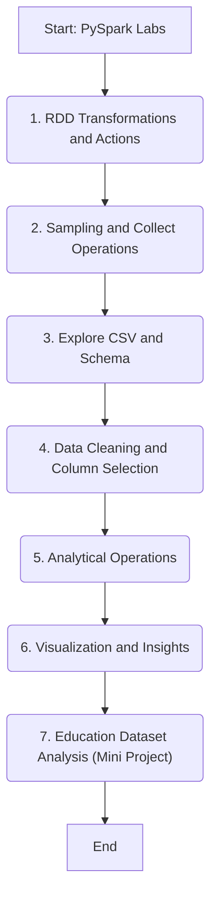

# Big Data Analytics with PySpark — Education Dataset (Mini Project)

This repository contains a structured series of PySpark lab exercises culminating in a **Mini Project on Indian District Education Data Analysis**.
It demonstrates **end-to-end PySpark workflow** — from data ingestion and transformation to aggregation, analysis, and visualization.

---

## Contents

1. Data Transformation Using PySpark RDD
2. collect(), sample(), and takeSample() Operations
3. Exploring CSV Data Structure and Schema
4. Data Cleaning and Column Operations
5. Analytical Operations on the Education Dataset
6. Visualization and Insights
7. Education Dataset Analysis Using PySpark (Mini Project)

Each notebook progressively builds analytical capability, leading to the final mini project notebook that performs full-scale district-level education analysis.

---

## Getting Started

### Prerequisites

* Python 3.9 or above
* Apache Spark 3.x with PySpark
* Jupyter Notebook or JupyterLab

### Installation

```bash
pip install pyspark jupyter
```

### Running the Notebooks

```bash
cd "C:/Users/LENOVO/BDA"
jupyter notebook
```

Then open any `.ipynb` file and **Run All Cells** sequentially.

---

## Education Dataset Mini Project

**Location:**
`Education Dataset Analytics(Mini Project)/`

**Files:**

* `Education_Data_Analytics_Using_PySpark.ipynb` — Main analysis notebook
* `EducationDataset.csv` — Source dataset
* `Education Data Analytics.pptx` — Presentation slides
* `Education Data Analytics Report.pdf` — Final report

---

## Example Questions Explored

* Which districts have the highest and lowest number of schools?
* How are boys and girls distributed across school levels (Primary → Sr. Secondary)?
* What is the retention rate of girls from Class X to Class XII?
* Which districts perform best and worst in Class X and XII results?
* How does school infrastructure relate to student enrollment?

The notebook demonstrates **data ingestion, transformation, aggregation, and visualization** using **PySpark**, **Matplotlib**, and **Seaborn**.

---

## Lab Highlights

* Data Cleaning and Schema Inference in PySpark
* Grouping and Aggregation (`groupBy`, `agg`, `count`, `avg`)
* Sorting and Filtering District Data
* Creating Derived Columns (e.g., Retention %, Total Schools)
* Writing Filtered DataFrames to CSV
* Visual Analytics (Bar Charts, Comparative Graphs)

---

## Key Results Summary

* **Total Districts Analyzed:** 33
* **Total Schools (All Levels):** ~660,000
* **Top Districts by School Count:** North, South West, West
* **Top Performing Districts (Class X):** Central, East, North East
* **Lowest Performing Districts (Class X):** South West, West, North West
* **Highest Number of Girl Students:** North, Central, East
* **Average Girls’ Retention (Class X → XII):** ~82%
* **Gender Ratio:** Girls ≈ 48% of total students

---

## Repository Workflow



---

## Conclusion

This project showcases how **PySpark** can efficiently process and analyze large-scale education data for district-level insights.

**Highlights:**

* Complete workflow from ingestion to visualization
* Data-driven insights on gender participation and performance
* Scalable PySpark approach for educational policy and planning analytics

**Developed as part of the Big Data Analytics Laboratory using Apache Spark and PySpark.**
